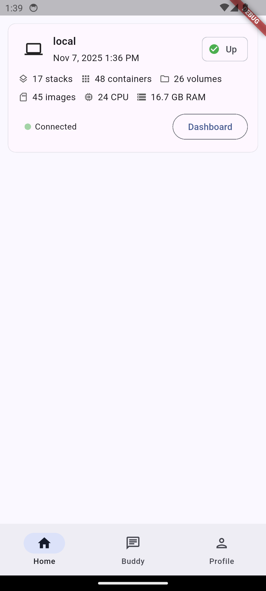
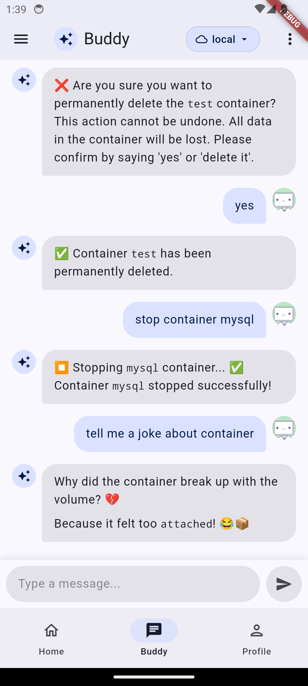
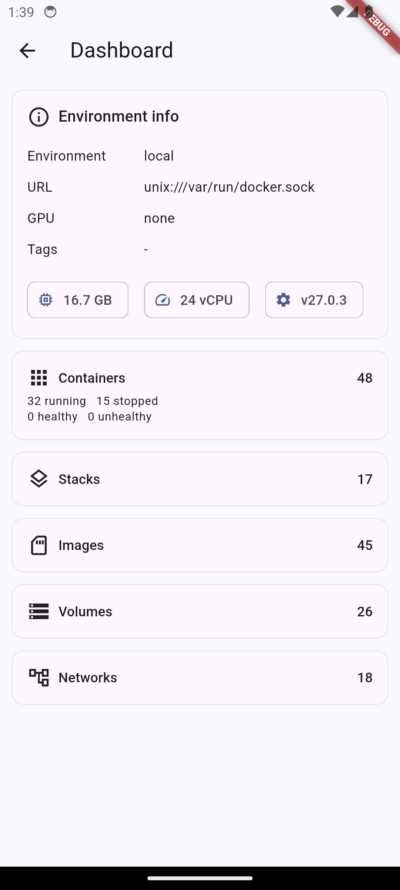
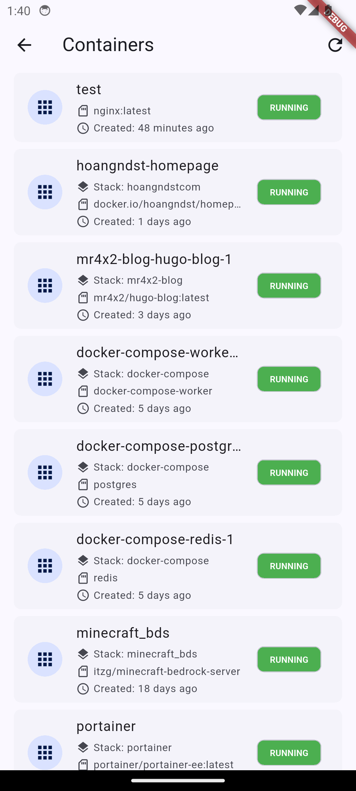
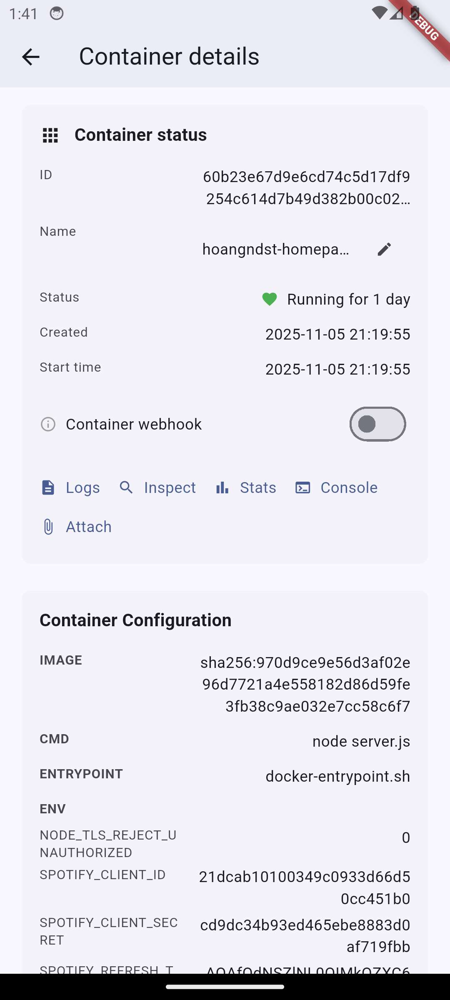
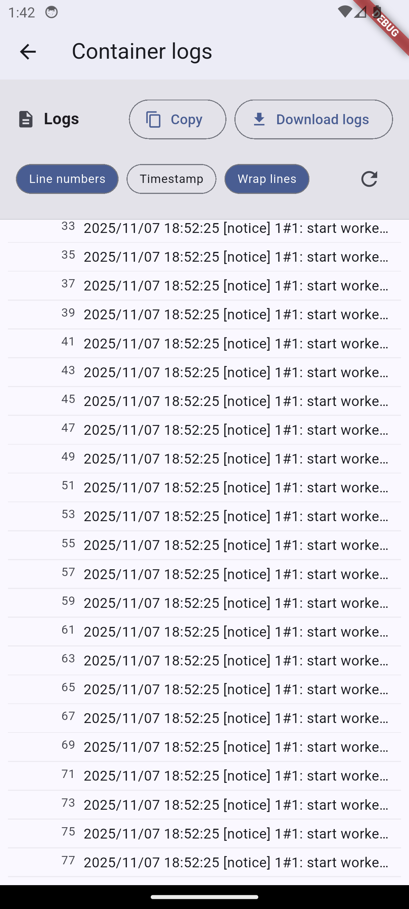

# Container Monitoring
Container Monitoring is a tool for monitoring containers. With AI assistant, help you to monitor and manage your containers.

  

    
    
    
  

  

    
    
    
  

## Getting Started

to be updated.
